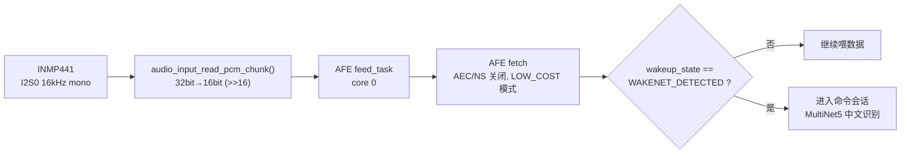
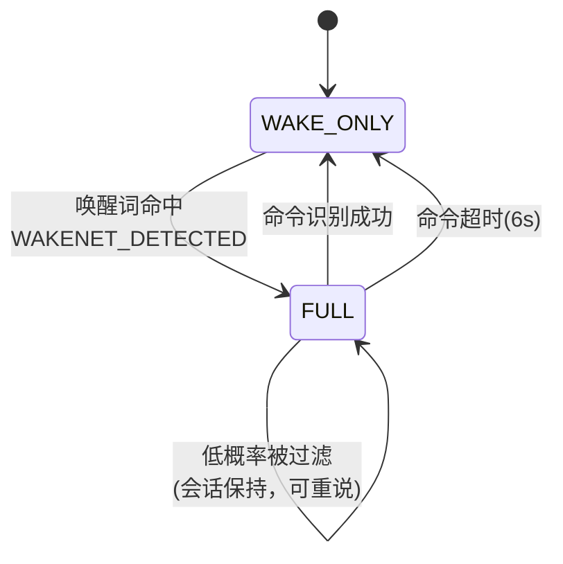

# 语音唤醒词（WakeNet）实现总结

## 一、唤醒词是什么

| 项目 | 值 |
|------|-----|
| 唤醒词文本 | **你好小鑫** |
| 模型名 | `wn9_nihaoxiaoxin_tts` |
| 网络版本 | WakeNet9 |
| 语言 | 中文（TTS 合成音源训练） |
| 部署路径 | `model` 分区（SPIFFS），运行时 `build/srmodels/wn9_nihaoxiaoxin_tts/` |

唤醒词模型由 ESP-SR 组件提供，通过 Kconfig 在编译期"烧"进 `model` 分区：

```kconfig
# sdkconfig.defaults:17
CONFIG_SR_WN_WN9_NIHAOXIAOXIN_TTS=y
```

> ⚠️ `sdkconfig` 里 WN9 系列其余 60+ 个唤醒词全部 `not set`，**只能同时加载一个唤醒词**，因此不能用多唤醒词方案（`CONFIG_SR_WN_WN9S_*` 系列已在 sdkconfig 中显式关闭）。

---

## 二、整体数据流



关键点：**WakeNet 与 MultiNet 挂在同一个 AFE 管道上**，共用一次特征提取，所以唤醒和命令识别不重复计算。

---

## 三、初始化流程

`speech_recognition_init()`（`src/speech_recognition.c:126`）分三步：

### 1. 加载模型分区

```c
s_speech.models = esp_srmodel_init("model");
```

分区表定义（`partitions.csv`）：

```
model,    data, spiffs,  0x810000, 0x700000   # 7 MB
```

### 2. 创建 AFE 配置

```c
afe_config_t *afe_config = afe_config_init("M", s_speech.models, AFE_TYPE_SR, AFE_MODE_LOW_COST);
afe_config->aec_init = false;                      // 单麦克风，无回声消除
afe_config->se_init  = false;                      // 无语音增强
afe_config->memory_alloc_mode = AFE_MEMORY_ALLOC_MORE_PSRAM;
```

- `"M"` 表示 Mic 单通道输入。
- **`AFE_MODE_LOW_COST`**：低算力模式，降低常驻功耗，代价是识别灵敏度略降。
- AEC 关闭是刻意的——INMP441 只有一路麦克风，没有回采参考信号。

### 3. 创建中文 MultiNet5

```c
char *model_name = esp_srmodel_filter(models, ESP_MN_PREFIX, ESP_MN_CHINESE);
model->data = model->iface->create(model_name, APP_COMMAND_TIMEOUT_MS);
```

`APP_COMMAND_TIMEOUT_MS = 6000`（`app_config.h:18`）—— 唤醒后 **6 秒内**必须说完命令，否则会话超时，重新回到只监听唤醒词的状态。

---

## 四、双子任务架构

`speech_recognition_start()` 在指定核心上创建两个任务：

| 任务名 | 函数 | 核心 | 栈 | 优先级 | 职责 |
|--------|------|------|-----|--------|------|
| `afe_feed` | `feed_task` | **core 0** | 8192 | 5 | I2S 读 PCM → `afe->feed()` |
| `sr_detect` | `detect_task` | **core 1** | 12288 | 5 | `afe->fetch()` → 唤醒/命令判定 |

分核设计让 I2S 采集与神经网络推理互不抢占，避免 DMA 溢出丢帧。

`feed_task` 还负责峰值统计（每 512 个 chunk，约 16 秒打印一次 `peak`），用于调试麦克风增益是否合理：

```c
ESP_LOGD(TAG, "AFE fed %u chunks, peak=%d", stats_counter, max_abs);
```

---

## 五、唤醒 → 命令 状态机



源码中由 `sr_mode_t s_mode` 跟踪（`speech_recognition.h:15`），同时驱动功耗策略：

- **`SR_MODE_WAKE_ONLY`**（待机）：只跑唤醒词，CPU 由 DFS 降到 **80 MHz**（默认档 160 MHz）。
- **`SR_MODE_FULL`**（会话期）：`pm_profile_high_perf_acquire()` 把 CPU 锁到 **240 MHz**，保证 MultiNet 推理实时性；会话一结束立即 `release()`。

### 唤醒命中时的动作序列（`detect_task`，行 271-283）

```c
if (result->wakeup_state == WAKENET_DETECTED) {
    lcd_backlight_activity();          // 1. 点亮背光（并解除 LCD sleep）
    s_mode = SR_MODE_FULL;             // 2. 模式切换
    pm_profile_high_perf_acquire();    // 3. CPU 拉 240 MHz
    lcd_ui_update(..., "我在听...");    // 4. LCD 提示
    voice_speak_im_here();             // 5. 播报"我在"（唤醒应答）
    speech->chinese.iface->clean(...); // 6. 清 MultiNet 残留状态
    speech->afe_iface->disable_wakenet(...); // 7. 关唤醒词检测
    command_session = true;
}
```

**第 7 步的设计要点**：唤醒后立刻 `disable_wakenet()`，把算力全部让给 MultiNet。命令结束/超时时再 `enable_wakenet()` 恢复待机监听。这样既省算力，也避免命令语句再次误触发唤醒词。

---

## 六、防误识别机制

### 1. 概率阈值过滤

```c
#define COMMAND_PROB_THRESHOLD  0.30f
```

MultiNet **总会**返回概率最高的匹配项，哪怕输入的是纯噪声。因此 `detect_command()` 会丢弃 `prob < 0.30` 的结果并 `clean()` 让模型重新检测：

```c
if (results->prob[0] < COMMAND_PROB_THRESHOLD) {
    ESP_LOGW(TAG, "Command %d rejected: prob=%.3f < %.2f", ...);
    *rejected = true;
    model->iface->clean(model->data);
    return -1;
}
```

> 经验值：正常语音 `prob > 0.4`，噪声/碰撞声 `< 0.2`。阈值选 0.30 只过滤明显噪声，保留模糊识别以兼顾灵敏度。

### 2. 连续低概率提示

```c
#define LOW_PROB_HINT_LIMIT  2
```

连续 2 次低概率被拒后播报"没听清，请再说一次"（`voice_speak_command_unclear()`），然后计数归零。期间 `command_session` **保持 true**，用户可以直接重说而无需再次唤醒。

### 3. 麦克风不削顶

`app_config.h:12-16` 有明确注释——INMP441 的 24 bit 数据右移 16 位得到 16 bit PCM：

```c
#define APP_MIC_SAMPLE_SHIFT  16
```

> **削顶（clip 到 ±32768）会破坏 WakeNet 的识别效果**，所以刻意保留约 96 dB 动态范围。

---

## 七、与电源管理的配合

### 背光超时（20s）

`LCD_BL_TIMEOUT_MS = 20000`。唤醒命中会调 `lcd_backlight_activity()` 重置计时，所以"唤醒即亮屏"是自动生效的。

### Light-Sleep（12 分钟）

`PM_LS_TIMEOUT_MS = 12 * 60 * 1000`（`app_config.h:39`）。睡眠前**不销毁 AFE 和模型**，只挂起 I2S：

```c
void speech_suspend_i2s(void) {
    g_sr_paused = true;              // 让 feed/detect 任务先进等待循环
    vTaskDelay(pdMS_TO_TICKS(50));   // 等它们退出当前 I2S read / fetch
    audio_input_stop();              // 再停 I2S DMA
}
```

唤醒后 `speech_resume_i2s()` 反向操作，并**强制回到 `SR_MODE_WAKE_ONLY`**：

```c
afe_iface->enable_wakenet(afe_data);   // 重开唤醒词检测
chinese.iface->clean(chinese.data);    // 清残留命令状态
while (pm_profile_is_high_perf()) {    // 释放可能残留的高算力锁
    pm_profile_high_perf_release();
}
s_mode = SR_MODE_WAKE_ONLY;
g_sr_paused = false;
```

> 强制回 WAKE_ONLY 的原因：防止睡眠前说了一半的命令残留在队列里，唤醒后立刻被当作完整命令执行。用户必须**重新说"你好小鑫"**才能进入命令会话。

### Deep-Sleep（GPIO0 触发）

深度睡眠唤醒等于整机重启（`app_main` 重新跑），所以不存在"恢复序列"——AFE、模型、任务全部重建。

---

## 八、语音反馈素材

唤醒应答"我在"是**预生成 WAV 素材**（不是 esp-tts 实时合成），见 `voice_assets/generate_assets.py:40`：

```python
"im_here.wav":       "我在",
```

播放链路（`voice_player`）：

```
voice_speak_im_here() 入队（非阻塞）
  → voice_task (core 1)
  → 暂停 SR（避免自己声音触发识别）
  → MAX98357A 解除静音(GPIO18 HIGH)
  → DSP 重置 → 素材拼接播放
  → 排空 → 静音 → 恢复 SR
```

**关键设计**：播放期间必须暂停 SR，否则喇叭声音经空气回灌到麦克风可能自触发唤醒。

---

## 九、LCD 状态提示

| 时机 | 显示文案 |
|------|----------|
| 开机完成 | `就绪 你好小鑫` |
| 唤醒命中 | `我在听...` |
| 命令会话超时 | `就绪 你好小鑫` |

中文字模需预先烧录，见 `voice_assets/gen_chinese_font.py:21` / `:27`：

```python
"就绪你好小鑫"        # 状态：就绪 你好小鑫
"我在听"              # 状态：我在听...
```

> ⚠️ **新增任何 LCD 中文文案，都必须同步加入这个字表并重新生成字库**，否则屏幕上显示为空白。

---

## 十、关键参数速查

| 宏 / 配置 | 位置 | 值 | 说明 |
|-----------|------|-----|------|
| `CONFIG_SR_WN_WN9_NIHAOXIAOXIN_TTS` | `sdkconfig.defaults:17` | `y` | 唤醒词模型 |
| `CONFIG_SR_MN_CN_MULTINET5_RECOGNITION_QUANT8` | `sdkconfig.defaults:18` | `y` | 中文命令模型 |
| `APP_COMMAND_TIMEOUT_MS` | `app_config.h:17` | `6000` | 唤醒后命令超时 |
| `COMMAND_PROB_THRESHOLD` | `speech_recognition.c:31` | `0.30f` | 命令概率阈值 |
| `LOW_PROB_HINT_LIMIT` | `speech_recognition.c:33` | `2` | 低概率提示次数 |
| `APP_MIC_SAMPLE_SHIFT` | `app_config.h:16` | `16` | 麦克风位深转换 |
| `PM_LS_TIMEOUT_MS` | `app_config.h:39` | `12 分钟` | Light-Sleep 触发 |
| `LCD_BL_TIMEOUT_MS` | `app_config.h:33` | `20000` | 背光关闭超时 |

---

## 十一、日志排查线索

| 日志 | 含义 |
|------|------|
| `SR detect task started, waiting for wake word (你好小鑫)` | 检测任务启动正常 |
| `Wake word detected! Listening for command...` | ✅ 唤醒命中 |
| `Chinese command=N probability=0.xxx` | 命令识别成功及置信度 |
| `Command N rejected: prob=0.xxx < 0.30` | 低概率被过滤 |
| `Low prob x2 -> speak unclear hint` | 连续低概率，播"没听清" |
| `AFE fed N chunks, peak=M` | 麦克风峰值（DEBUG 级），`peak` 长期 < 500 说明增益太低 |
| `AFE fetch failed` | AFE 管道异常 |
| `Chinese MultiNet model is missing` | `model` 分区未烧录或唤醒词配置不匹配 |

---

## 十二、命令词中文对照表

命令在代码中是以**拼音字符串**注册给 MultiNet 的（`esp_mn_commands_add()`），
下表列出拼音与其对应的中文说法。

### 计分命令

格式：`<玩家> 地主 <胜负> <分数>`

| 拼音（代码） | 中文说法 |
|--------------|----------|
| `yi hao` | 一号 |
| `er hao` | 二号 |
| `san hao` | 三号 |
| `di zhu` | 地主 |
| `ying` | 赢 |
| `shu` | 输 |

| 拼音（代码） | 中文说法 | 分值 |
|--------------|----------|------|
| `liang fen` | 两分 | 2 |
| `si fen` | 四分 | 4 |
| `liu fen` | 六分 | 6 |
| `ba fen` | 八分 | 8 |
| `yi shi fen` | 十分 | 10 |
| `yi shi er fen` | 十二分 | 12 |
| `yi shi si fen` | 十四分 | 14 |
| `yi shi liu fen` | 十六分 | 16 |
| `yi shi ba fen` | 十八分 | 18 |
| `er shi fen` | 二十分 | 20 |

示例：

| 拼音（代码） | 中文说法 |
|--------------|----------|
| `yi hao di zhu ying liang fen` | 一号地主赢两分 |
| `er hao di zhu shu ba fen` | 二号地主输八分 |
| `san hao di zhu ying er shi fen` | 三号地主赢二十分 |

### 功能命令

| 拼音（代码） | 中文说法 | 命令 ID |
|--------------|----------|---------|
| `cha xun fen shu` | 查询分数 | `CMD_QUERY_SCORE` |
| `chong zhi suo you fen shu` | 重置所有分数 | `CMD_RESET_SCORE` |
| `cha kan ji fen ri zhi` | 查看计分日志 | `CMD_VIEW_LOG` |
| `qing chu ji fen ri zhi` | 清除计分日志 | `CMD_CLEAR_LOG` |

> **代码位置**：`src/scorekeeper.c` 的 `PLAYER_PHRASES`（行 53）、
> `POINT_PHRASES`（行 59）、`scorekeeper_register_commands()`（行 374）。
> 计分命令共 3 玩家 × 2 胜负 × 10 分值 = **60 条**，加上 4 条功能命令，共 64 条。

